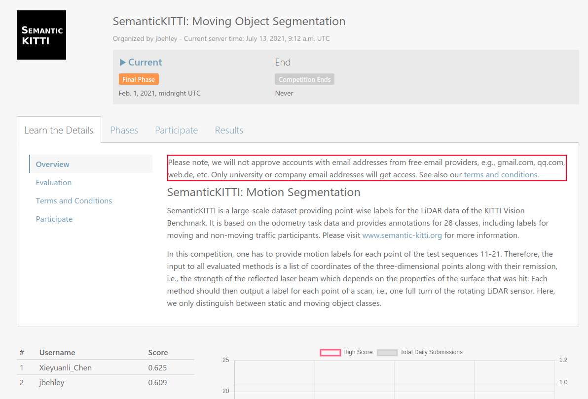
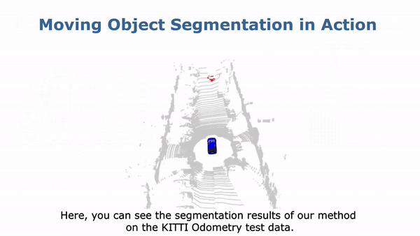
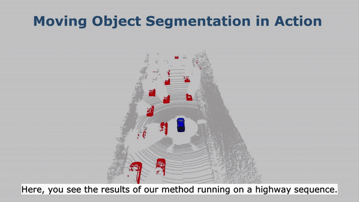
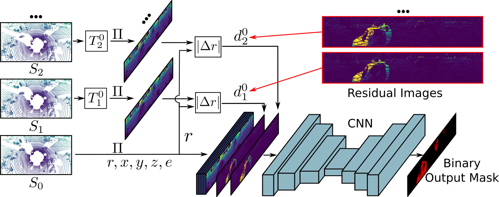
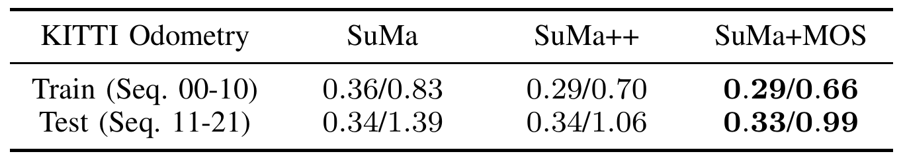
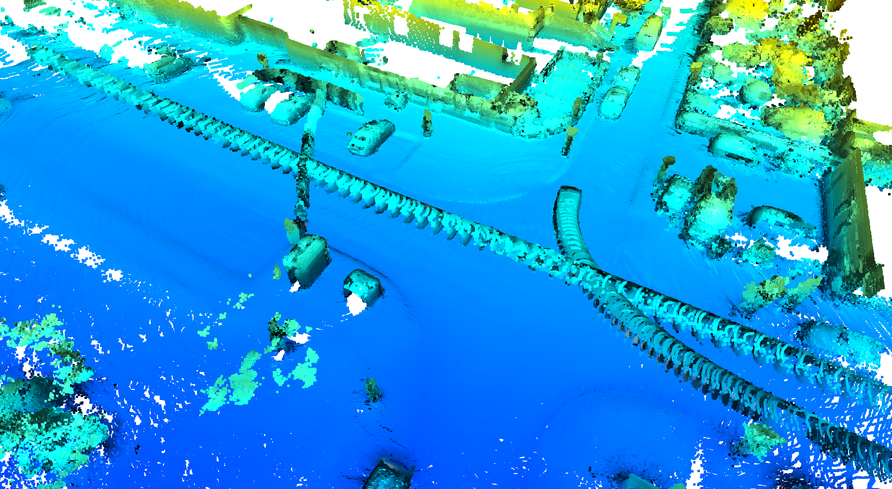
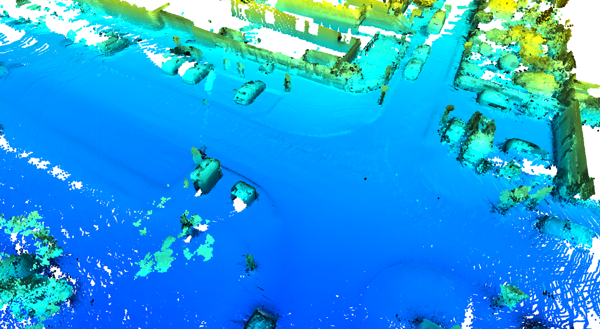

# LMNet: Moving Object Segmentation in 3D LiDAR Data
This repo contains the code for our paper: Moving Object Segmentation in 3D LiDAR Data:
A Learning-based Approach Exploiting Sequential Data [PDF](https://www.ipb.uni-bonn.de/pdfs/chen2021ral-iros.pdf).

Our approach accurately segments the scene into moving and static objects, i.e., distinguishing between moving cars vs. parked cars.
It runs faster than the frame rate of the sensor and can be used to improve 3D LiDAR-based odometry/SLAM and mapping results as shown [below](#Applications).

Additionally, we created a new benchmark for LiDAR-based moving object segmentation based on SemanticKITTI [here](https://bit.ly/mos-benchmark).



Complete demo video can be found in YouTube [here](https://youtu.be/NHvsYhk4dhw). LiDAR-MOS in action:

 

### Table of Contents
1. [Introduction of the repo and benchmark](#LiDAR-MOS:-Moving-Object-Segmentation-in-3D-LiDAR-Data)
2. [Publication](#Publication)
3. [Log](#Log)
4. [Dependencies](#Dependencies)
5. [How to use](#How-to-use)
6. [Applications](#Applications)
7. [Collection of downloads](#Collection-of-downloads)
8. [License](#License)


## Publication
If you use our code and benchmark in your academic work, please cite the corresponding [paper](https://www.ipb.uni-bonn.de/pdfs/chen2021ral-iros.pdf):
    
    @article{chen2021ral,
		title={{Moving Object Segmentation in 3D LiDAR Data: A Learning-based Approach Exploiting Sequential Data}},
		author={X. Chen and S. Li and B. Mersch and L. Wiesmann and J. Gall and J. Behley and C. Stachniss},
		year={2021},
		volume=6,
		issue=4,
		pages={6529-6536},
		journal={IEEE Robotics and Automation Letters (RA-L)},
		url = {http://www.ipb.uni-bonn.de/pdfs/chen2021ral-iros.pdf},
		doi = {10.1109/LRA.2021.3093567},
		issn = {2377-3766},
	}


## Log

### News 20220706
Our MotionSeg3D is open-source [here](https://github.com/haomo-ai/MotionSeg3D).

It uses a dual-branch and -head structure to fuse Spatial-Temporal information for LiDAR moving object segmentation.


### News 20220615
Our 4DMOS is open-source [here](https://github.com/PRBonn/4DMOS).

It uses sparse CNN on 4D point clouds for LiDAR moving object segmentation.


### v1.1
Thanks **Jiadai Sun** for testing and correcting some bugs of SalsaNext-MOS.

More setups can also be found here: [#47](https://github.com/PRBonn/LiDAR-MOS/issues/47)

### v1.0
Open-source version


## Dependencies
We built and tested our work based on [SalsaNext](https://github.com/Halmstad-University/SalsaNext), [RangeNet++](https://github.com/PRBonn/lidar-bonnetal) and [MINet](https://arxiv.org/pdf/2008.09162v1.pdf).
We thank the original authors for their nice work and implementation. If you are interested in fast LiDAR-based semantic segmentation, we strongly recommend having a look at the original repositories.

**Note that**, in this repo, we show that how easily we could achieve LiDAR-based moving object segmentation exploiting sequential information with existing segmentation networks.
We didn't change the original pipeline of the segmentation networks, but only changed the data loader and input of the network as shown in the figure below.
Therefore, our method can be used with any range-image-based LiDAR segmentation networks.

Our method is based on range images. To use range projection with fast c++ library, please find the usage doc [here](https://github.com/PRBonn/overlap_localization/tree/master/src/prepare_training).




## How to use
For a quick test of all the steps below, one could download a toy dataset [here](https://www.ipb.uni-bonn.de/html/projects/LiDAR-MOS/LiDAR_MOS_toy_dataset.zip) and decompress it in the `data\` folder following the data structure [data/README.md](data/README.md).

### Prepare training data
To use our method, one needs to generate the residual images. Here is a quick demo:
```sh
  $ python3 utils/gen_residual_images.py
```
More setup about the data preparation can be found in the yaml file [config/data_preparing.yaml](config/data_preparing.yaml).
To prepare the training data for the whole KITTI-Odometry dataset, please download the [original website](https://www.cvlibs.net/datasets/kitti/eval_odometry.php). 

### Using SalsaNext as the baseline
To use SalsaNext as the baseline segmentation network for LiDAR-MOS, one should follow the [mos_SalsaNext/README.md](mos_SalsaNext/README.md) to set it up.

Note that, we use pytorch v1.5.1+cu101 which is different from the original one. More information about the related issue is [here](https://github.com/PRBonn/LiDAR-MOS/issues/24).

#### Inferring
To generate the LiDAR-MOS predictions with pretrained model with one residual image ([download](https://www.ipb.uni-bonn.de/html/projects/LiDAR-MOS/model_salsanext_residual_1.zip), please `unzip` before using). Quick test on toy dataset, directly run
```sh
  $ cd mos_SalsaNext/train/tasks/semantic
  $ python3 infer.py -d ../../../../data -m ../../../../data/model_salsanext_residual_1 -l ../../../../data/predictions_salsanext_residual_1_new -s valid
```

Inferring the whole dataset, please download the KITTI-Odometry dataset from the [original website](https://www.cvlibs.net/datasets/kitti/eval_odometry.php), and change the corresponding paths.
```sh
  $ cd mos_SalsaNext
  $ python3 infer.py -d path/to/kitti/dataset -m path/to/pretrained_model -l path/to/log -s train/valid/test # depending of desired split to evaluate
```

#### Training
To train a LiDAR-MOS network with SalsaNext from scratch, one has to download the [KITTI-Odometry dataset](https://www.cvlibs.net/datasets/kitti/eval_odometry.php) and [Semantic-Kitti dataset](http://semantic-kitti.org/):
Change the corresponding paths and run:
```sh
  $ cd mos_SalsaNext/train/tasks/semantic
  $ ./train.sh -d path/to/kitti/dataset -a salsanext_mos.yml -l path/to/log -c 0  # the number of used gpu cores
```

### Using RangeNet++ as the baseline 
To use RangeNet++ as the baseline segmentation network for LiDAR-MOS, one should follow the [mos_RangeNet/README.md](mos_RangeNet/README.md) to set it up.

#### Inferring
Inferring the whole dataset, please download the KITTI-Odometry dataset from the [original website](https://www.cvlibs.net/datasets/kitti/eval_odometry.php), the [pretrained model](https://www.ipb.uni-bonn.de/html/projects/LiDAR-MOS/model_rangenet_residual_1.zip) and change the corresponding paths.
```sh
  $ cd mos_RangeNet/tasks/semantic
  $ python3 infer.py -d path/to/kitti/dataset -m path/to/pretrained_model -l path/to/log -s train/valid/test # depending of desired split to evaluate
```

#### Training
To train a LiDAR-MOS network with RangeNet++ from scratch, one has to download the [KITTI-Odometry dataset](https://www.cvlibs.net/datasets/kitti/eval_odometry.php) and [Semantic-Kitti dataset](http://semantic-kitti.org/) and
change the corresponding paths and run:
```sh
  $ cd mos_RangeNet/tasks/semantic
  $ python3 train.py -d path/to/kitti/dataset -ac rangenet_mos.yaml -l path/to/log
```

More pretrained model and LiDAR-MOS predictions can be found in [collection of downloads](#Collection-of-downloads).

### Evaluation and visualization
#### How to evaluate
**Evaluation metrics**. Let's call the **moving (dynamic)** status as **D** and the **static** status as **S**.

Since we ignore the unlabelled and invalid status, therefore in MOD there are only two classes.

| GT\Prediction | dynamic | static |
| --------      | ------- | ------ |
| dynamic       | TD      |   FS   |
| static        | FD      |   TS   |

- $$ IoU_{MOS} = \frac{TD}{TD+FD+FS} $$

To evaluate the MOS results on the toy dataset just run:
```sh
  $ python3 utils/evaluate_mos.py -d data -p data/predictions_salsanext_residual_1_valid -s valid
```

To evaluate the MOS results on our **LiDAR-MOS benchmark** please have a look at our [semantic-kitti-api](https://github.com/PRBonn/semantic-kitti-api) and benchmark [website](https://bit.ly/mos-benchmark).

#### How to visualize the predictions
To visualize the MOS results on the toy dataset just run:
```sh
  $ python3 utils/visualize_mos.py -d data -p data/predictions_salsanext_residual_1_valid -s 8  # here we use a specific sequence number
```
where:
 - `sequence` is the sequence to be accessed.
 - `dataset` is the path to the kitti dataset where the sequences directory is.

Navigation:
 - `n` is next scan,
 - `b` is previous scan,
 - `esc` or `q` exits.


## Applications
LiDAR-MOS is very important for building consistent maps, making future state predictions, avoiding collisions, and planning.
It can also improve and robustify pose estimation, sensor data registration, and SLAM.
Here we show two obvious applications of our LiDAR-MOS which are LiDAR-based odometry/SLAM as well as 3D mapping.
Before that, we show two simple examples of how to combine our method with semantics and clean the scans.
After cleaning scans we can get better odometry/SLAM and 3D mapping results.

**Note that**, here we show two direct use cases of our MOS approach without any further optimizations employed.


### Enhanced with semantics
To show a simple way of combining our LiDAR-MOS with semantics, we provide a quick demo with the toy dataset:
```sh
  $ python3 utils/combine_semantics.py
```
It just simply checks whether the moving objects are movable classes or not. If not, re-assigned as static.


### Clean the scans
To clean the LiDAR scans with our LiDAR-MOS as masks, we also provide a quick demo on the toy dataset:
```sh
  $ python3 utils/scan_cleaner.py
```

### Odometry/SLAM
Using the cleaned LiDAR scans, we see that by simply applying our MOS predictions as a preprocessing mask, the odometry results are improved in both
the KITTI training and test data and even slightly better than the carefully-designed full classes semantic-enhanced SuMa++.



The testing results of our methods can also be found in [KITTI-Odometry benchmark](https://www.cvlibs.net/datasets/kitti/eval_odometry.php).

### Mapping
we compare the aggregated point cloud maps (left) directly with the raw LiDAR
scans, (right) with the cleaned LiDAR scans by applying our MOS predictions as masks.
As can be seen, there are moving objects present that pollute the map, which might have adversarial effects, when used for localization or path
planning. By using our MOS predictions as masks, we can effectively remove these artifacts and get a clean map. 

 

#### Map cleaning
For offline map cleaning, **Giseop Kim** combined his [Removert](https://github.com/irapkaist/removert) and LiDAR-MOS, and got very good results.
More information can be found in [#28](https://github.com/PRBonn/LiDAR-MOS/issues/28).


## Collection of downloads
 - [LiDAR_MOS_toy_dataset](https://www.ipb.uni-bonn.de/html/projects/LiDAR-MOS/LiDAR_MOS_toy_dataset.zip)                           (toy dataset used for the quick demos)
 - [predictions_salsanext_semantic](https://www.ipb.uni-bonn.de/html/projects/LiDAR-MOS/predictions_salsanext_semantic.zip)        (semantic segmentation results from SalsaNext for all sequences 00 - 21) 
 - [predictions_salsanext_residual_8_sem](https://www.ipb.uni-bonn.de/html/projects/LiDAR-MOS/predictions_salsanext_residual_8_sem.zip)  (**Our best!** LiDAR-MOS results using SalsaNext with 8 residual images + semantics) 
 - [model_rangenet_residual_1](https://www.ipb.uni-bonn.de/html/projects/LiDAR-MOS/model_rangenet_residual_1.zip)             (pretrained model using RangeNet++ with 1 residual image) 
 - [model_salsanext_residual_1](https://www.ipb.uni-bonn.de/html/projects/LiDAR-MOS/model_salsanext_residual_1.zip)            (pretrained model using SalsaNext with 1 residual image)
 - [model_salsanext_residual_8](https://www.ipb.uni-bonn.de/html/projects/LiDAR-MOS/model_salsanext_residual_8.zip)            (pretrained model using SalsaNext with 8 residual image)
 

## License
This project is free software made available under the MIT License. For details see the LICENSE file.
